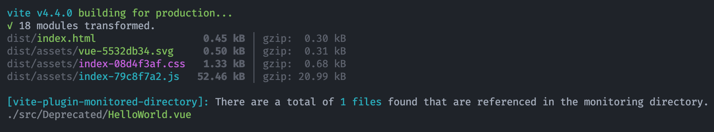

# vite-plugin-monitored-directory

> To check if any files in the monitored directory are referenced and provide a prompt.

## Features

- [x] check if any files in the monitored directory are referenced and provide a prompt.

## Snapshot

[Example](./examples/my-vue-app/vite.config.js)



## Try it now

```typescript
import { defineConfig } from 'vite';
import vue from '@vitejs/plugin-vue';
import Plugin from '../../src/index';

// https://vitejs.dev/config/
export default defineConfig({
  plugins: [vue(), Plugin()],
});
```

## LICENSE

[MIT](./LICENSE) License © 2023 [zwkang](https://github.com/zwkang)
